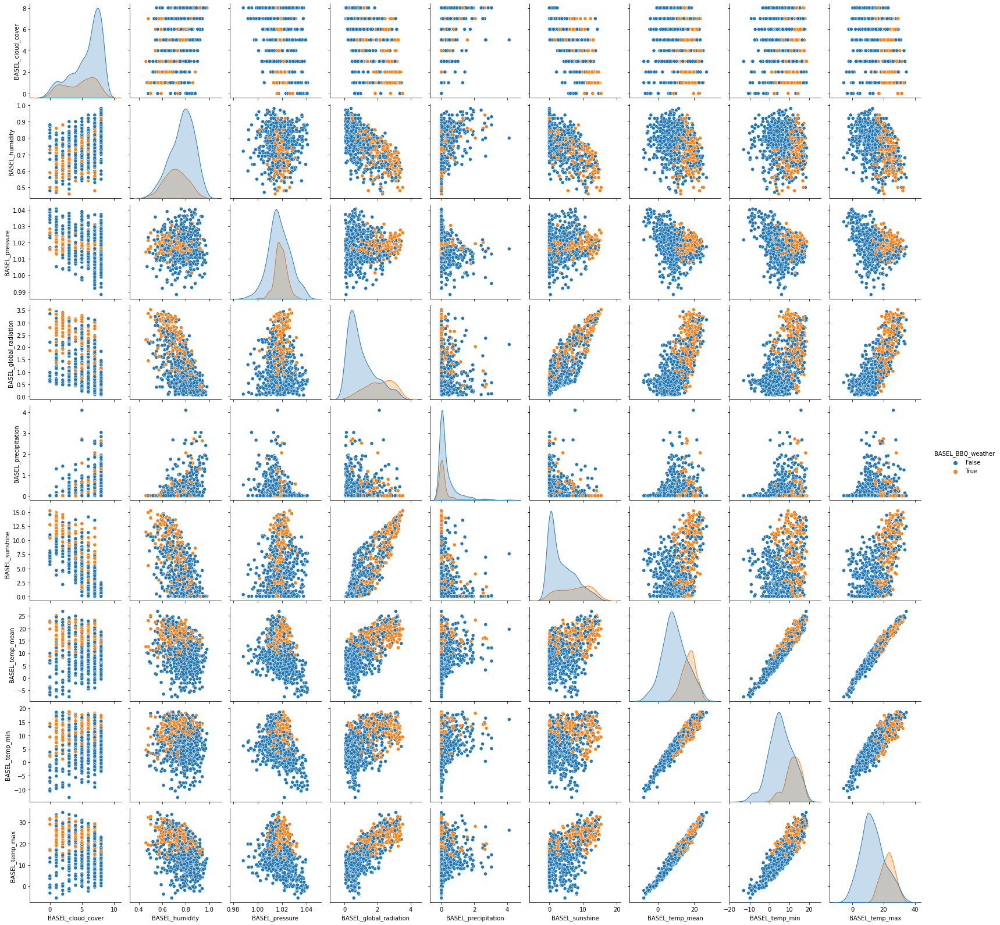

:::::: questions

- What should I look for when exploring a dataset for machine learning?
- How do I split the dataset using scikitlearn?

::::::

:::::: objectives

- Get to know the weather prediction dataset
- Know the steps in the machine learning workflow
- Know how to do exploratory data analysis
- Know how to split the data in train and test set

::::::

## Supervised versus unsupervised machine learning 
Remember we make the following distinction:

 - **Supervised** models try to predict a (dependent) variable, called the *target*, that is available during training time
 - **Unsupervised** models try to find structure or patterns in the data, without a specific target

::::::::::::::::::::::::::::::::::::: challenge

## Challenge: Supervised or unsupervised

For the following problems, do you think you need a supervised or unsupervised approach?

1. Find numerical representations for words in a language (*word vectors*) that contain semantic information on the word
2. Determine whether a tumor is benign or malign, based on an MRI-scan
3. Predict the age of a  patient, based on an EEG-scan
4. Cluster observations of plants into groups of individuals that have similar properties, possibly belonging to the same species
5. Your own problem and dataset

:::::::::::::::: solution

1. Unsupervised
2. Supervised
3. Supervised
4. Unsupervised
5. Discuss!

:::::::::::::::::::::::::

:::::::::::::::::::::::::::::::::::::::::::::::


## Machine learning workflow
For most machine learning approaches, we have to take the following steps:

1. Data cleaning and preperation
2. Split data into train and test set
3. Optional: Feature selection
4. Use cross validation to:
   - Train one or more ML models on the train set
   - Choose optimal model / parameter settings based on some metric
5. Calculate final model performance on the test set

::: callout
## Discussion
Why is it important to reserve part of your data as test set? What can go wrong in choosing a test set?
:::

### Importing packages
We import `pandas` for tabular data processing and `seaborn` for data visualization.
```python
import seaborn as sns
import pandas as pd
```

## Weather prediction dataset
Here we want to work with the weather prediction dataset. It contains daily weather observations from 18 different European cities or places through the years 2000 to 2010. For all locations the data contains the variables ‘mean temperature’, ‘max temperature’, and ‘min temperature’. In addition, for multiple of the following variables are provided: 'cloud_cover', 'wind_speed', 'wind_gust', 'humidity', 'pressure', 'global_radiation', 'precipitation', 'sunshine', but not all of them are provided for all locations. A more extensive description of the dataset including the different physical units is given in accompanying metadata file.


There are several tasks that one could think of given this data. For now, we are intested in the question: how likely is it to be nice weather for a barbecue tomorrow (that is, sunny and no rain) in Basel, given the weather conditions in all cities today?

:::::::::::::::::::::::::::::::::::::challenge

## Challenge: What kind of task?
What kind of machine learning task is this?

:::::::::::::::: solution

A supervised binary classification task.

:::::::::::::::::::::::::
:::::::::::::::::::::::::::::::::::::::::::::::

### Loading the data
We load the data directly from a URL.


```python
url_features = 'https://zenodo.org/record/5071376/files/weather_prediction_dataset.csv?download=1'
url_labels = 'https://zenodo.org/record/5071376/files/weather_prediction_bbq_labels.csv?download=1'
weather_features = pd.read_csv(url_features)
weather_labels = pd.read_csv(url_labels)
```

Let's take a look at the first 5 rows of the features:
```python
weather_features.head()
```

And let's look at the `labels` data:
```python
weather_labels.head()
```

We can inspect the shape of the data:
```python
print(weather_labels.shape)
```

```output
(3654, 18)
```


Let's print all the column names:
```python
for c in weather_features.columns:
    print(c)
```

```output
    DATE
    MONTH
    BASEL_cloud_cover
    BASEL_humidity
    ...
```

:::::::::::::::::::::::::::::::::::::challenge

## Challenge: Explore weather dataset
Explore the dataset with pandas:

 1. How many features do we have to predict the BBQ weather? 
 2. How many samples does this dataset have?
 3. What datatype is the target label stored in?
 
:::::::::::::::: solution

## Solution
### 1. & 2. How many features and samples?? 
```python
# Nr of columns, nr of rows:
weather_features.shape
```
```output
(3654, 165)
```
So we have 3654 samples. Of the 165 columns, the first column is the date, we ommit this column for prediction.
The second column is  `Month`, this could be a useful feature but we will only use the numerical features for now. So we have 163 features left.

### 3. What datatype is the target label stored in?
The target class stored in the `BASEL_BBQ_weather` column of the labels dataset, and its type is a boolean:

```python
type(weather_labels['BASEL_BBQ_weather'][0])
```
```output
numpy.bool_
```

:::::::::::::::::::::::::
:::::::::::::::::::::::::::::::::::::::::::::::

## Data selection

For the purposes of this lesson, we select only the first 3 years. 
We also remove all columns that cannot be used for prediction, 
and merge the features and labels into one dataframe.


```python
nr_rows = 365*3

weather_3years = weather_features.drop(columns=['DATE', 'MONTH'])
weather_3years = weather_3years[:nr_rows]

# Need to take next day as target!
weather_3years['BASEL_BBQ_weather'] = list(weather_labels[1:nr_rows+1]['BASEL_BBQ_weather'])

print(weather_3years.shape)
```
```output
(1095, 164)
```

Let's look at the head of the data we just created:
```python
weather_3years.head()
```

## Split into train and test
Before doing further exploration of the data, we held out part of the data as test set for later. This way, no information from the test set will leak to the model we are going to create


```python
from sklearn.model_selection import train_test_split
```


```python
data_train, data_test = train_test_split(weather_3years, test_size=0.3, random_state=0)
```


```python
len(data_train), len(data_test)
```

```output
(766, 329)
```

We write the train and test set to csv files because we will be needing them later.
We create the data directory if it does not exist.

```python
import os

if not os.path.exists('data'):
    os.mkdir('data')
data_train.to_csv('data/weather_train.csv', index=False)
data_test.to_csv('data/weather_test.csv', index=False)
```

## Some more data exploration using visualization
Let's visualize the numerical feature columns.
One nice visualization for datasets with relatively few attributes is the Pair Plot.
This can be created using `sns.pairplot(...)`. It shows a scatterplot of each attribute plotted against each of the other attributes.
By using the `hue='BASEL_BBQ_weather'` setting for the pairplot the graphs on the diagonal are layered kernel density estimate plots.

Because we have so many features, we plot the features only for Basel itself (not the other cities).

Note that we use a list comprehension here, a short notation for creating a 
new list based on values in an existing list
```python
columns_basel = [c for c in data_train.columns if c.startswith('BASEL')]
data_plot = data_train[columns_basel]
```


```python
sns.pairplot(data_plot, hue='BASEL_BBQ_weather')
```

Output:


::::::::::::::::::::::::::::::challenge

## Exercise: Observe the pairplot

Discuss what you see in the scatter plots and write down any observations. Think of:

- Are the classes easily separable based on these features?
- What are potential difficulties for a classification algorithm?
- What do you note about the units of the different attributes?

::::::::::::::::::::::::::::::::::::::

:::::: keypoints

- Use the machine learning workflow to tackle a machine learning problem in a structured way
- Get to know the dataset before diving into a machine learning task
- Use an independent testset for evaluating your results

::::::::::::::::
